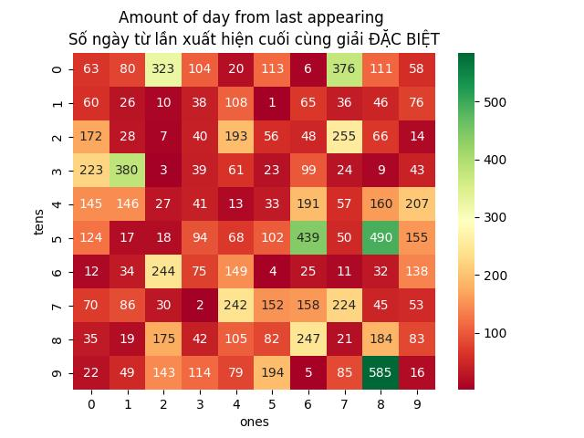
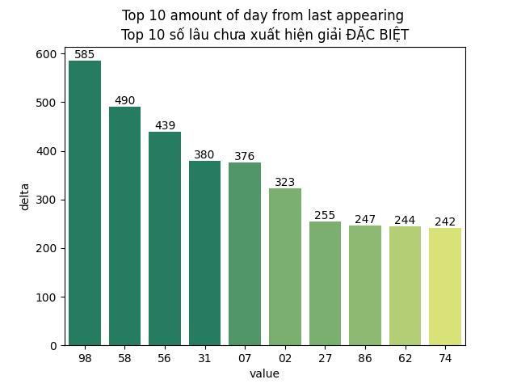
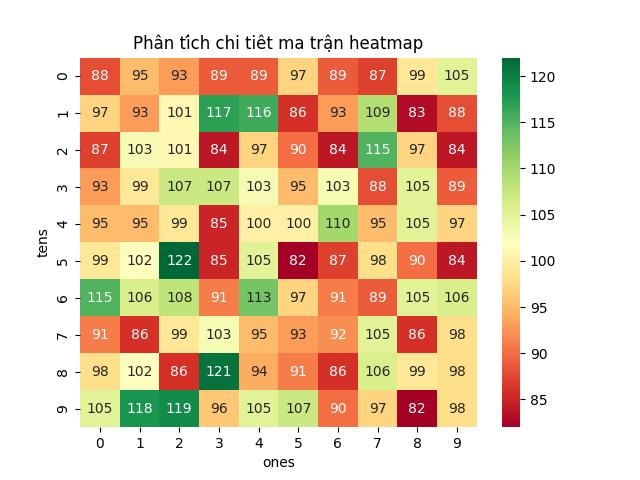
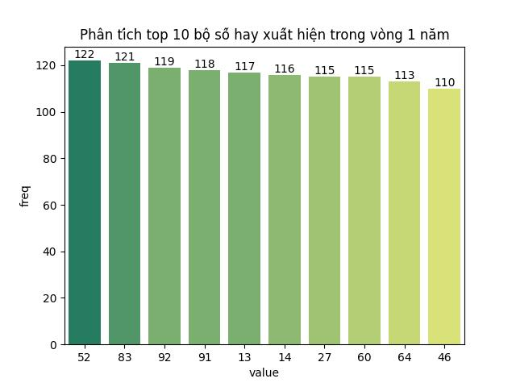
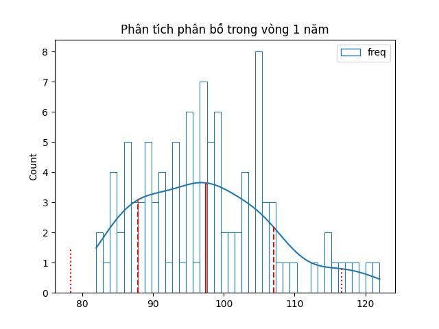
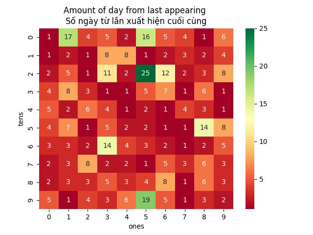
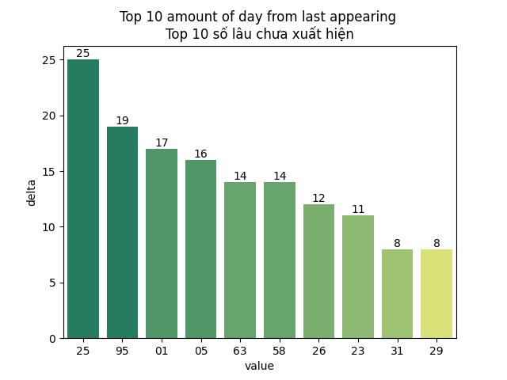

# 

___

## Lottery (Xổ số)
<table><tr><td>Date (Ngày)</td><td>28-09-2026</td></tr><tr><td>Special (Giải đặc biệt)</td><td>77115</td></tr><tr><td>First (Giải nhất)</td><td>86908</td></tr><tr><td>Second (Giải nhì)</td><td>03746, 63746</td></tr><tr><td rowspan="2">Third (Giải ba)</td><td>82891, 66534, 99344</td></tr><tr><td>44000, 17956, 65367</td></tr><tr><td>Fourth (Giải tư)</td><td>4233, 6533, 1949, 8237</td></tr><tr><td rowspan="2">Fifth (Giải năm)</td><td>6322, 3012, 2139</td></tr><tr><td>9110, 0408, 4557</td></tr><tr><td>Sixth (Giải sáu)</td><td>333, 052, 144</td></tr><tr><td>Seventh (Giải bảy)</td><td>87, 97, 75, 22</td></tr></table>

## Loto (Lô tô)
<table><tr><td>First (Đầu)</td><td>Last (Đuôi)</td></tr><tr><td>0</td><td>0, 8, 8</td></tr><tr><td>1</td><td>0, 2, 5</td></tr><tr><td>2</td><td>2, 2</td></tr><tr><td>3</td><td>3, 3, 3, 4, 7, 9</td></tr><tr><td>4</td><td>4, 4, 6, 6, 9</td></tr><tr><td>5</td><td>2, 6, 7</td></tr><tr><td>6</td><td>7</td></tr><tr><td>7</td><td>5</td></tr><tr><td>8</td><td>7</td></tr><tr><td>9</td><td>1, 7</td></tr></table>

## Data (Dữ liệu)

|          | CSV | JSON | Parquet |
|----------|-----|------|---------|
| Raw      | [xsmb.csv](https://raw.githubusercontent.com/AnhTuPhi/xsmb-vietnam-lottery-analysis/refs/heads/master/data/xsmb.csv) | [xsmb.json](https://raw.githubusercontent.com/AnhTuPhi/xsmb-vietnam-lottery-analysis/refs/heads/master/data/xsmb.json) | [xsmb.parquet](https://raw.githubusercontent.com/AnhTuPhi/xsmb-vietnam-lottery-analysis/refs/heads/master/data/xsmb.parquet) |
| 2-digits | [xsmb-2-digits.csv](https://raw.githubusercontent.com/AnhTuPhi/xsmb-vietnam-lottery-analysis/refs/heads/master/data/xsmb-2-digits.csv) | [xsmb-2-digits.json](https://raw.githubusercontent.com/AnhTuPhi/xsmb-vietnam-lottery-analysis/refs/heads/master/data/xsmb-2-digits.json) | [xsmb-2-digits.parquet](https://raw.githubusercontent.com/AnhTuPhi/xsmb-vietnam-lottery-analysis/refs/heads/master/data/xsmb-2-digits.parquet) |
| Sparse   | [xsmb-sparse.csv](https://raw.githubusercontent.com/AnhTuPhi/xsmb-vietnam-lottery-analysis/refs/heads/master/data/xsmb-sparse.csv) | [xsmb-sparse.json](https://raw.githubusercontent.com/AnhTuPhi/xsmb-vietnam-lottery-analysis/refs/heads/master/data/xsmb-sparse.json) | [xsmb-sparse.parquet](https://raw.githubusercontent.com/AnhTuPhi/xsmb-vietnam-lottery-analysis/refs/heads/master/data/xsmb-sparse.parquet) |

## Analysis of special prices (Phân tích kết quả xổ số)

Max: 122. Min: 82.

Mean: 97.47. Standard deviation: 9.56.

---

  <strong>⭐ If you find this project useful, please consider giving it a star!</strong>

