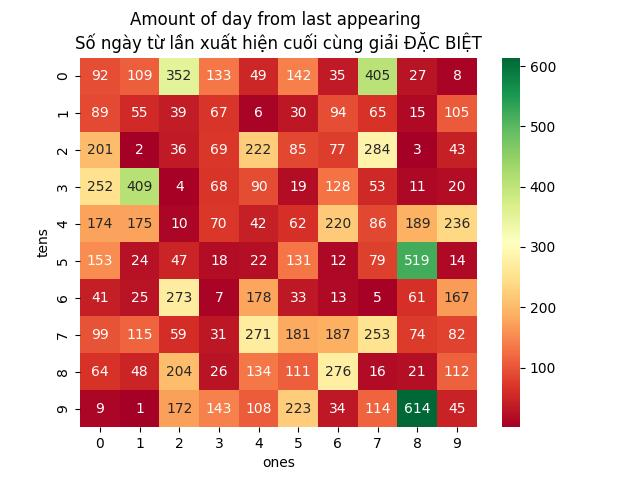
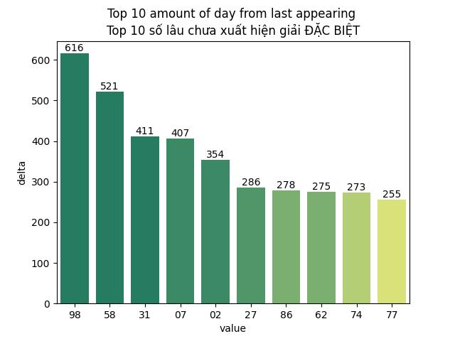
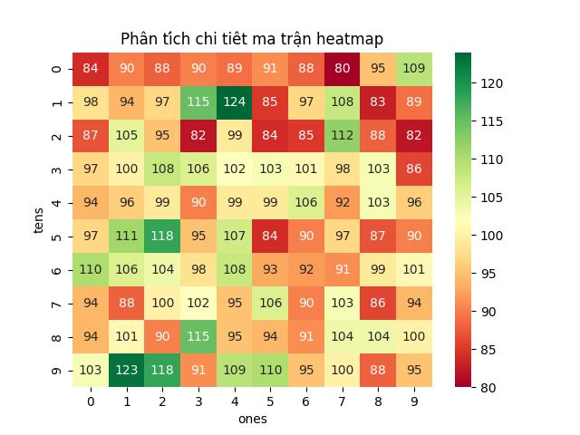
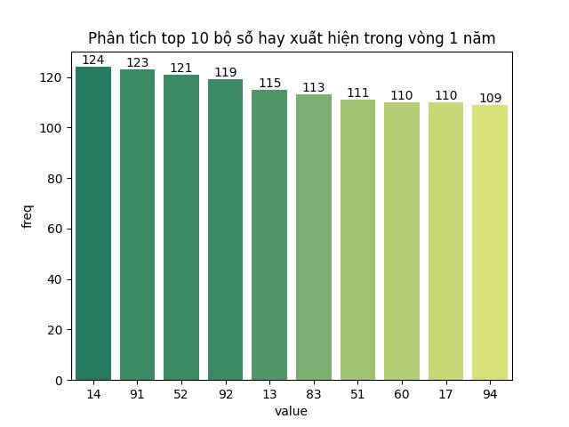
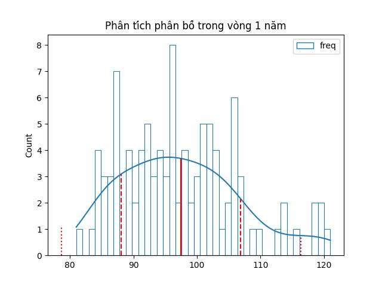
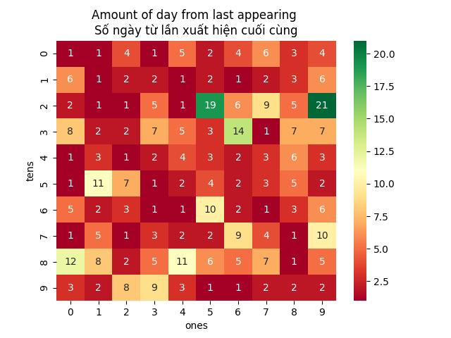
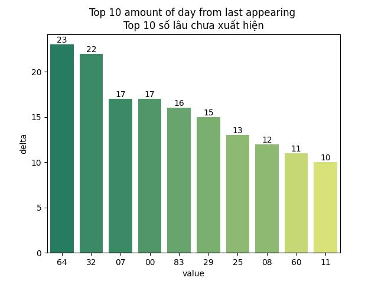

# 

___

## Lottery (Xổ số)
<table><tr><td>Date (Ngày)</td><td>28-10-2026</td></tr><tr><td>Special (Giải đặc biệt)</td><td>74175</td></tr><tr><td>First (Giải nhất)</td><td>18190</td></tr><tr><td>Second (Giải nhì)</td><td>62731, 30468</td></tr><tr><td rowspan="2">Third (Giải ba)</td><td>95839, 63573, 61608</td></tr><tr><td>11741, 53427, 95088</td></tr><tr><td>Fourth (Giải tư)</td><td>4748, 4683, 0750, 5861</td></tr><tr><td rowspan="2">Fifth (Giải năm)</td><td>5728, 8517, 1385</td></tr><tr><td>6152, 3575, 1561</td></tr><tr><td>Sixth (Giải sáu)</td><td>001, 997, 249</td></tr><tr><td>Seventh (Giải bảy)</td><td>58, 30, 05, 41</td></tr></table>

## Loto (Lô tô)
<table><tr><td>First (Đầu)</td><td>Last (Đuôi)</td></tr><tr><td>0</td><td>1, 5, 8</td></tr><tr><td>1</td><td>7</td></tr><tr><td>2</td><td>7, 8</td></tr><tr><td>3</td><td>0, 1, 9</td></tr><tr><td>4</td><td>1, 1, 8, 9</td></tr><tr><td>5</td><td>0, 2, 8</td></tr><tr><td>6</td><td>1, 1, 8</td></tr><tr><td>7</td><td>3, 5, 5</td></tr><tr><td>8</td><td>3, 5, 8</td></tr><tr><td>9</td><td>0, 7</td></tr></table>

## Data (Dữ liệu)

|          | CSV | JSON | Parquet |
|----------|-----|------|---------|
| Raw      | [xsmb.csv](https://raw.githubusercontent.com/AnhTuPhi/xsmb-vietnam-lottery-analysis/refs/heads/master/data/xsmb.csv) | [xsmb.json](https://raw.githubusercontent.com/AnhTuPhi/xsmb-vietnam-lottery-analysis/refs/heads/master/data/xsmb.json) | [xsmb.parquet](https://raw.githubusercontent.com/AnhTuPhi/xsmb-vietnam-lottery-analysis/refs/heads/master/data/xsmb.parquet) |
| 2-digits | [xsmb-2-digits.csv](https://raw.githubusercontent.com/AnhTuPhi/xsmb-vietnam-lottery-analysis/refs/heads/master/data/xsmb-2-digits.csv) | [xsmb-2-digits.json](https://raw.githubusercontent.com/AnhTuPhi/xsmb-vietnam-lottery-analysis/refs/heads/master/data/xsmb-2-digits.json) | [xsmb-2-digits.parquet](https://raw.githubusercontent.com/AnhTuPhi/xsmb-vietnam-lottery-analysis/refs/heads/master/data/xsmb-2-digits.parquet) |
| Sparse   | [xsmb-sparse.csv](https://raw.githubusercontent.com/AnhTuPhi/xsmb-vietnam-lottery-analysis/refs/heads/master/data/xsmb-sparse.csv) | [xsmb-sparse.json](https://raw.githubusercontent.com/AnhTuPhi/xsmb-vietnam-lottery-analysis/refs/heads/master/data/xsmb-sparse.json) | [xsmb-sparse.parquet](https://raw.githubusercontent.com/AnhTuPhi/xsmb-vietnam-lottery-analysis/refs/heads/master/data/xsmb-sparse.parquet) |

## Analysis of special prices (Phân tích kết quả xổ số)

Max: 124. Min: 81.

Mean: 97.47. Standard deviation: 9.33.

---

  <strong>⭐ If you find this project useful, please consider giving it a star!</strong>

