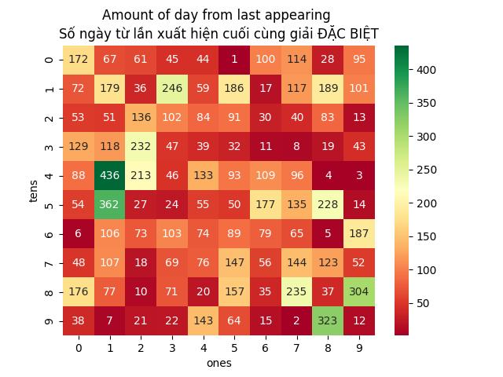
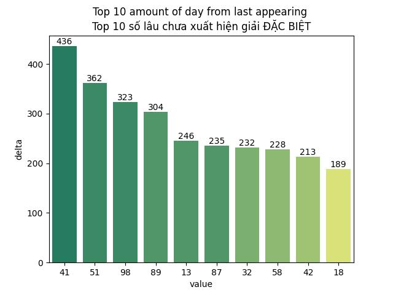
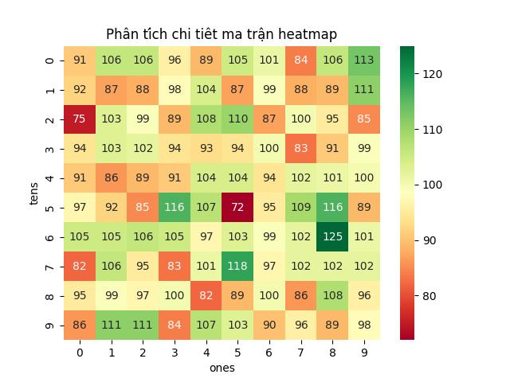
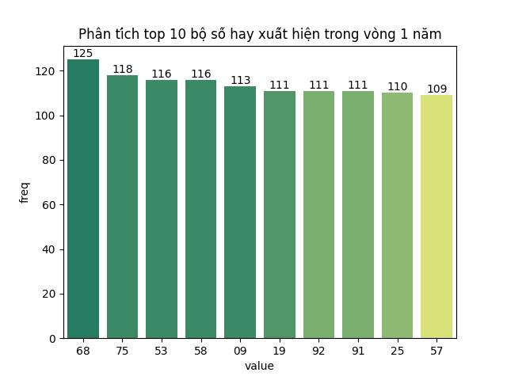
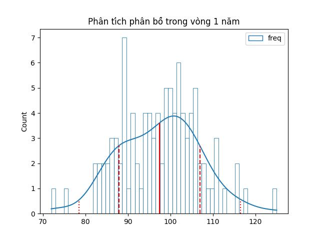
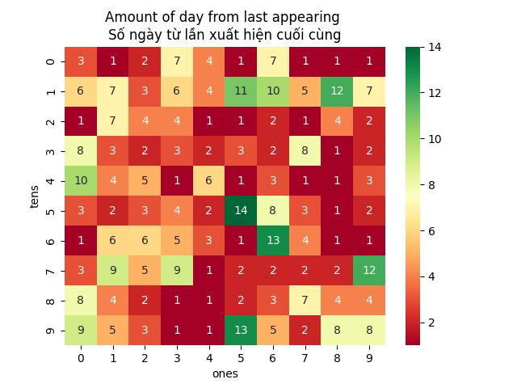
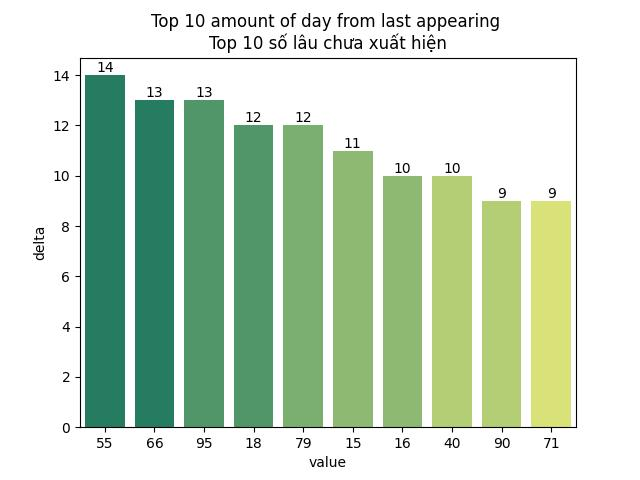

# Vietnam Lottery (XSMB) Analysis

## 📋 Table of Contents

- [📖 Description](#-description)
- [📦 Boilerplate](#-boilerplate)
- [🕵️ Features](#-features)
- [⚙️ How it works?](#-how-it-works)
- [🚀 Installation & Usage](#-installation--usage)
- [📖 References](#-references)
- [📖 Summary](#-summary)
- [📄 License](#-license)

## 📖 Description

This project focuses on analyzing the Northern Vietnam Lottery (Xổ Số Miền Bắc – XSMB) results.
It collects historical draw data, processes it, and generates statistics, frequency distributions, and visual insights to help understand lottery patterns.

## 📦 Boilerplate

Fork from original
repo [clean architecture python boilerplate](https://github.com/AnhTuPhi/clean-architecture-python-boilerplate)

## 🕵️ Features

### 🔎 Key Features

📊 Data Collection – Fetches official XSMB results daily. (Free version - Public Repo)

⚡ Automation – GitHub Actions automatically update results and refresh insights. (Free version - Public Repo)

📈 Statistical Analysis – Computes number frequency, hot/cold numbers, and distribution trends. (Available in charge fee version - Private Repo)

📉 Visualization – Charts and graphs showing historical trends and probability insights. (Available in charge fee version - Private Repo)

🔮 Exploratory Prediction – Initial attempts at forecasting possible outcomes based on historical data. (Available in charge fee version - Private Repo)

### 🎯 Purpose

The goal of this project is not gambling but rather:

- Learning data analysis and visualization with real-world datasets.
- Exploring patterns and randomness in lottery systems.
- Experimenting with prediction models for educational purposes.

## ⚙️ How it works?

### 🤖 Automated Data Collection

This project runs completely automatically using **Github Actions** - no server required - aiming to be serverless!

- ⏰ Schedule: Runs daily via **GitHub Actions workflow**
- 🔄 Process: Fetches latest results → Processes data → Commits to repository
- 📊 Analysis: Generates statistics and updates /data and README.md automatically

### 🕵️ Data Crawling Method

The data collection works by:

- 🔍 Network Analysis: Inspecting browser-server communication
- 🐍 Python Replication: Recreating the data fetch logic in Python
- 📋 Structured Storage: Saving results in JSONL format for easy analysis
- 🔄 Continuous Updates: Daily automated runs ensure fresh data

> **Note:** This is purely for educational and research purposes. No gambling advice is provided.

## 🚀 Installation & Usage

Install requirement dependencies

```sh
pip install -r requirement.txt
```

Run service

```sh
python ./xxx.py
```

## 📖 References

Document references in [this](https://github.com/AnhTuPhi/xsmb-vietnam-lottery-analysis/blob/master/REFERENCES.md)

## 📖 Summary

| Lottery (Xổ số) | Loto (Lô tô) |
| :------------: | :----------: |
| <table><tr><td>Date (Ngày)</td><td>05-01-2026</td></tr><tr><td>Special (Giải đặc biệt)</td><td>70505</td></tr><tr><td>First (Giải nhất)</td><td>05501</td></tr><tr><td>Second (Giải nhì)</td><td>48493, 16909</td></tr><tr><td rowspan="2">Third (Giải ba)</td><td>18738, 29020, 86274</td></tr><tr><td>90525, 03324, 31558</td></tr><tr><td>Fourth (Giải tư)</td><td>7048, 4168, 1108, 5083</td></tr><tr><td rowspan="2">Fifth (Giải năm)</td><td>5260, 2009, 1307</td></tr><tr><td>7469, 7284, 2745</td></tr><tr><td>Sixth (Giải sáu)</td><td>525, 408, 194</td></tr><tr><td>Seventh (Giải bảy)</td><td>47, 43, 65, 27</td></tr></table> | <table><tr><td>First (Đầu)</td><td>Last (Đuôi)</td></tr><tr><td>0</td><td>1, 5, 7, 8, 8, 9, 9</td></tr><tr><td>1</td><td>-</td></tr><tr><td>2</td><td>0, 4, 5, 5, 7</td></tr><tr><td>3</td><td>8</td></tr><tr><td>4</td><td>3, 5, 7, 8</td></tr><tr><td>5</td><td>8</td></tr><tr><td>6</td><td>0, 5, 8, 9</td></tr><tr><td>7</td><td>4</td></tr><tr><td>8</td><td>3, 4</td></tr><tr><td>9</td><td>3, 4</td></tr></table> |

## Data (Dữ liệu)

|          | CSV | JSON | Parquet |
|----------|-----|------|---------|
| Raw      | [xsmb.csv](https://raw.githubusercontent.com/AnhTuPhi/xsmb-vietnam-lottery-analysis/refs/heads/master/data/xsmb.csv) | [xsmb.json](https://raw.githubusercontent.com/AnhTuPhi/xsmb-vietnam-lottery-analysis/refs/heads/master/data/xsmb.json) | [xsmb.parquet](https://raw.githubusercontent.com/AnhTuPhi/xsmb-vietnam-lottery-analysis/refs/heads/master/data/xsmb.parquet) |
| 2-digits | [xsmb-2-digits.csv](https://raw.githubusercontent.com/AnhTuPhi/xsmb-vietnam-lottery-analysis/refs/heads/master/data/xsmb-2-digits.csv) | [xsmb-2-digits.json](https://raw.githubusercontent.com/AnhTuPhi/xsmb-vietnam-lottery-analysis/refs/heads/master/data/xsmb-2-digits.json) | [xsmb-2-digits.parquet](https://raw.githubusercontent.com/AnhTuPhi/xsmb-vietnam-lottery-analysis/refs/heads/master/data/xsmb-2-digits.parquet) |
| Sparse   | [xsmb-sparse.csv](https://raw.githubusercontent.com/AnhTuPhi/xsmb-vietnam-lottery-analysis/refs/heads/master/data/xsmb-sparse.csv) | [xsmb-sparse.json](https://raw.githubusercontent.com/AnhTuPhi/xsmb-vietnam-lottery-analysis/refs/heads/master/data/xsmb-sparse.json) | [xsmb-sparse.parquet](https://raw.githubusercontent.com/AnhTuPhi/xsmb-vietnam-lottery-analysis/refs/heads/master/data/xsmb-sparse.parquet) |

## Using

You can use `curl` or `wget` to download data files. Or you can load them directly into DataFrame:

Bạn có thể sử dụng curl hoặc wget để tải các tệp dữ liệu. Hoặc bạn có thể tải chúng trực tiếp vào DataFrame:

```sh
wget https://raw.githubusercontent.com/AnhTuPhi/xsmb-vietnam-lottery-analysis/refs/heads/master/data/xsmb.csv
```

```sh
curl -O https://raw.githubusercontent.com/AnhTuPhi/xsmb-vietnam-lottery-analysis/refs/heads/master/data/xsmb-2-digits.csv
```

```python
import pandas as pd

df = pd.read_csv('https://raw.githubusercontent.com/AnhTuPhi/xsmb-vietnam-lottery-analysis/refs/heads/master/data/xsmb-sparse.csv')
df.info()
```

## Data





Max: 125. Min: 72.

Mean: 97.47. Standard deviation: 9.49.











## 📄 License

This project is licensed under the MIT License - see
the [LICENSE](https://github.com/AnhTuPhi/xsmb-vietnam-lottery-analysis/blob/master/LICENSE) file for details.

---

<div align="center">
  <strong>⭐ If you find this project useful, please consider giving it a star!</strong>
</div>